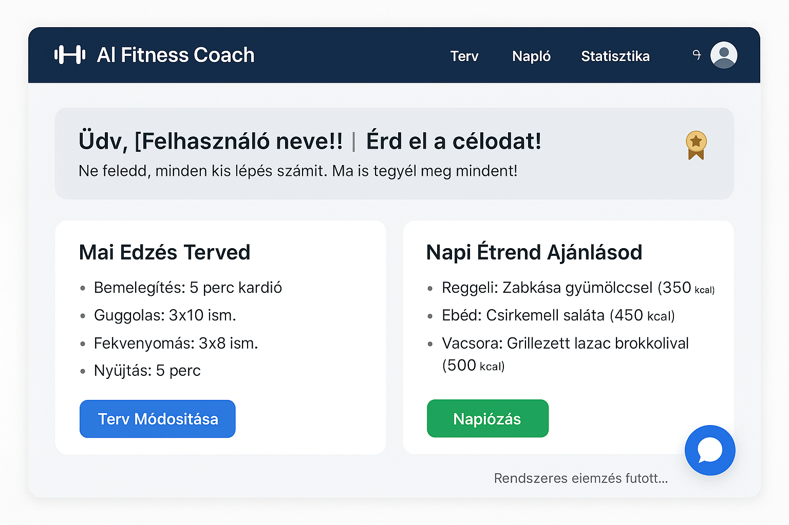

## 3. Követelménylista

## Felhasználói Folyamatok (User Flow)

A rendszer célja, hogy a felhasználó egy **egyszerű, átlátható és interaktív** folyamat során érje el a céljait, egy **személyes, digitális edző** támogatásával. A következőkben bemutatjuk a felhasználói folyamatokat a belépéstől a napi terv adaptálásáig.

### Használati esetek

1.  **Alkalmazás Indítása és Profil Frissítése**
    A felhasználó megnyitja a webalkalmazást a böngészőben. A kezdőképernyőn a Bejelentkezés/Regisztráció történik. Ez kötelező lépés, mivel az adatok (célok, nem, súly) a **személyre szabott tervek** generálásához szükségesek (**K1**). A belépés után azonnal betöltődik a **React Dashboard** (**K4**).

2.  **AI Terv Generálás és Adaptálás**
    Az irányítópult megjeleníti az AI által generált **aktuális edzés- és étrendtervet** (**K2**). A felhasználó bármikor kezdeményezheti a terv frissítését vagy módosítását. A **Gemini API** a felhasználó teljesítménye és céljai alapján azonnal válaszol:
    * **Helyes adaptáció** esetén a terv automatikusan nehezebbé válik.
    * **Hibás adaptáció** (pl. kihagyott napok) esetén a rendszer az állapothoz igazított, könnyített tervet generál, valamint **szöveges figyelmeztetést** küld (**K3**).

3.  **Naplózás Képernyő**
    A felhasználó a navigációs sávon keresztül lép be a Naplózó Képernyőre (**K5**). Itt két fő tevékenységet végezhet:
    * **Edzés rögzítése:** Megadja az elvégzett gyakorlatok részleteit (ismétlések, súly).
    * **Étrend rögzítése:** Beírja a fogyasztott ételt. A rendszer a bevitelt azonnal kiegészíti a **Nutritionix API-tól** lekérdezett pontos tápértékkel (**K3**).

4.  **Visszajelzés és Motiváció**
    Az adatok rögzítése után (**K6**) a rendszer azonnal elemzést végez (**K3**):
    * **Szöveges visszajelzés:** A **Gemini AI** azonnal kiírja a Dashboardra a teljesítmény értékelését (pl. "Gratulálok a 15%-os súlyemelés növekedéshez!").
    * **Játékos elemek:** Az elért célkitűzésekért a felhasználó **jelvényeket** kap (**K7**).

5.  **Haladás Megtekintése**
    A felhasználó a **Statisztika** nézetre navigál. Itt megjelennek az interaktív **grafikonok** (**K4**) a súly, a teljesítmény és az étkezés változásairól.

6.  **AI Tanácsadás és Kilépés**
    A felhasználó a Chat ablakon keresztül (**K3/K4**) azonnali tanácsot kérhet a **Gemini API-tól**. A program bezárható, a **PostgreSQL adatbázisban** tárolt adatok (**K1/K6**) megőrződnek.

## Forgatókönyv

-   A felhasználó megnyitja az alkalmazást, bejelentkezik, és a **Dashboardon** látja az **AI-generált** napi tervét.

-   Elvégzi az edzést, majd a **Naplózó Képernyőn** (**K5**) rögzíti a vacsoráját (pl. "saláta csirkével").

-   A rendszer a **Nutritionix API** segítségével lekéri a tápértékeket, majd a **Gemini AI** elemzi, hogy a felhasználó túllépte-e a napi kalóriakeretét. (**K3**)

-   A **Gemini AI** azonnali **szöveges visszajelzést** küld a felhasználónak a Dashboardon (pl. "Nagyszerű edzés! Ügyelj a holnapi vízfogyasztásra!"). (**K3**)

-   A felhasználó a **Chatben** (K3/K4) felteszi a kérdését: "Mit egyek vacsorára?", amire a **Gemini API** azonnal válaszol.

-   A **Statisztika** nézetben a felhasználó látja, hogy új **jelvényt** szerzett (**K7**).

-   Ezután frissíti a profilját, (**K1**) és a rendszer **adaptálja** a tervet, (**K2**) majd kilép. 

Ez a felhasználói folyamat biztosítja, hogy az edzés és a táplálkozás követése **egyszerű, intuitív és motiváló** legyen, miközben valós idejű, személyre szabott segítséget nyújt.

## Megfeleltetés, hogyan fedik le a használati esetek a követelményeket

A felhasználói felület és a különböző funkciók szoros kapcsolatban állnak a követelményekkel. A fő cél a személyre szabott fitnesz- és táplálkozási támogatás nyújtása.

-   **Felhasználói Felület (**K4**):**
    * A **Dashboard** megjeleníti a **Gemini AI** által generált tervek és a haladási adatok összefoglalóját (**K2, K4**).
    * A navigációs sáv biztosítja az egyszerű átjárást a Naplózó (**K5**) és a Statisztika (**K4**) nézetek között.
    * A **React** reszponzivitása támogatja a **letisztult dizájnt**.

-   **AI Terv Képernyő:**
    * Az edzés- és étrendterv megjelenítése a **Gemini API** funkcionalitását testesíti meg (**K2**).
    * A terv folyamatos **adaptálása** a felhasználói adatok alapján biztosítja az optimális fejlődést.

-   **Visszajelzés és Motiváció:**
    * A **Szöveges visszajelzés** azonnali, személyre szabott megerősítést ad a felhasználónak a rögzített adatok elemzése alapján (**K3**).
    * A **Jelvények** (K7) megjelenítése és az elért célkitűzések státusza fokozza a **motivációt**.

-   **Adatkezelés és Integráció:**
    * A Naplózó képernyőn az adatok azonnal mentésre kerülnek a **PostgreSQL** adatbázisba (**K6, K1**).

## Képernyő Tervek

A képernyő tervek részletesen bemutatják az alkalmazás főbb nézeteit, amelyek a **React** és a **Bootstrap** keretrendszerekre épülnek, és az **AI** elemeket emelik ki.

-   **Főképernyő (Dashboard):**
    * Felső rész: A felhasználó neve, az aktuális cél. A navigációs sáv gombjai: *Terv*, *Napló*, *Statisztika*.
    * Középső Rész: Két fő **Bootstrap kártya**: **Napi Edzés Terv** és **Étrend Javaslat**. A kártyák a **Gemini API** legfrissebb adatait tartalmazzák. (**K2**)
    * Motivációs/Visszajelzés szekció: Itt jelenik meg a **Gemini** legutóbbi szöveges elemzése (**K3**), valamint a legújabb **jelvény** (**K7**).
    * **Letisztult**, modern, **reszponzív** elrendezés a **Bootstrap** komponensekkel.

-   **Naplózó Képernyő:**
    * Felső rész: Egy **React Form** az Edzés- és az Étkezés adatok beviteli mezőivel.
    * Ételkereső mező: Ide írja be a felhasználó az étel nevét, majd alatta azonnal megjelennek a **Nutritionix API** adatai a pontos rögzítéshez. (**K5**)

-   **Statisztika Képernyő:**
    * Felső rész: Interaktív **grafikonok** (vonal, oszlop) a teljesítmény (súly/ismétlésszám) és a súly (**K4**) változásairól.
    * Alul: A **célkitűzések** (**K7**) százalékos teljesülése.

-   **AI Chat Képernyő:** (**K3/K4**)
    * Felület, amely a **Gemini API-val** való valós idejű kommunikációt szolgálja (**K3**). Hagyományos chat ablak elrendezésben, ahol a felhasználó kérdést ír be, és azonnal választ kap.

-   **Reszponzív dizájn:**
    * A felület **React** és **Bootstrap** alapú kialakítása révén jól működik asztali gépen és mobil eszközökön is, garantálva a **reszponzív megjelenést**. (**K4**)

    