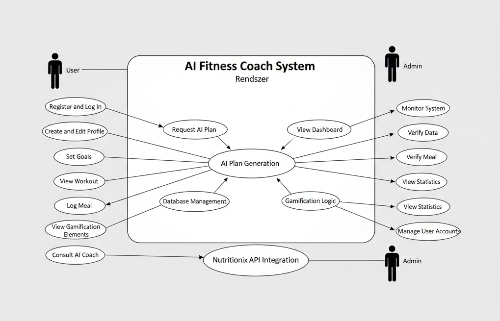
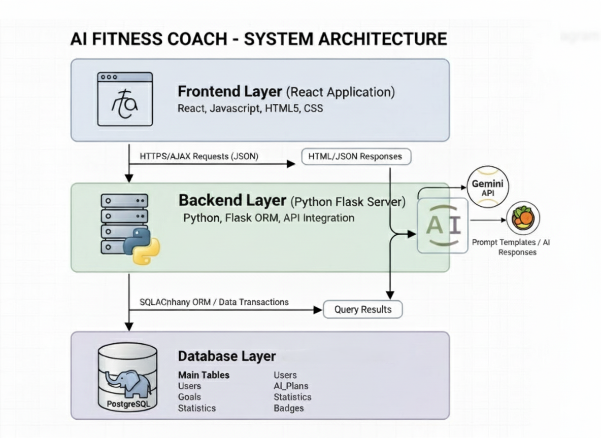
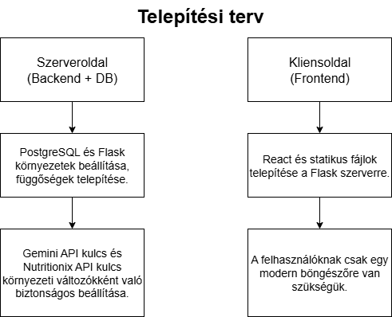
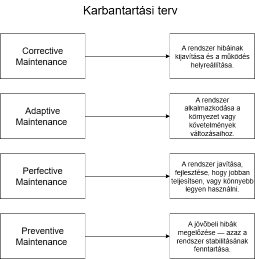

# Rendszerterv

## Üzleti folyamatok modellje

Az **AI Fitness Coach** rendszer célja, hogy egy intelligens, személyre szabott edzési és életmódtámogató platformot biztosítson a felhasználók számára. A folyamat középpontjában az AI-alapú tervgenerálás és a valós idejű visszajelzés áll, amely lehetővé teszi, hogy minden felhasználó saját igényeihez igazított támogatást kapjon.

A rendszer üzleti folyamata a következő lépésekre bontható:

1. **Regisztráció és profilkezelés:**  
   A felhasználó létrehozza profilját, megadja alapadatait (nem, életkor, testsúly, célok), amelyeket az adatbázisban tárol a rendszer.  
   Ezek az adatok képezik az AI ajánlásainak alapját.

2. **Célok meghatározása és adatgyűjtés:**  
   A felhasználó beállíthat konkrét célokat (pl. fogyás, izomnövelés, állóképesség javítás).  
   A rendszer naplózza a haladást, és figyeli az esetleges hiányos adatokat.

3. **AI tervgenerálás:**  
   Az alkalmazás a Gemini AI modellhez továbbítja a felhasználó adatait.  
   A modell visszaküldi az edzési és étrendi javaslatokat, amelyeket a backend feldolgoz, validál és eltárol.

4. **Terv megjelenítés és interakció:**  
   A frontend React-alapú dashboardja jeleníti meg az aktuális edzéstervet, heti összesítéseket és motivációs elemeket (pl. jelvények, fejlődés mértéke).

5. **Felhasználói naplózás és visszajelzés:**  
   A felhasználó rögzíti edzéseit és étkezéseit.  
   Ezek az adatok frissítik a statisztikákat, és az AI újraértékeli a terveket, szükség esetén módosításokat javasol.

6. **Motiváció és gamification:**  
   A rendszer pontokat, ranglistát és jelvényeket ad, hogy ösztönözze a felhasználót a rendszeres aktivitásra.

7. **Haladás és statisztika:**  
   A backend feldolgozza az adatokat, és összesített statisztikát generál, amely a felhasználó teljesítményének időbeli alakulását jeleníti meg a grafikonokon.

## Követelmények
A rendszer követelményei két nagy csoportra oszthatók: funkcionális és nem funkcionális követelmények.

### Funkcionális követelmények

- **Felhasználói profilkezelés:** regisztráció, bejelentkezés, célok beállítása, adatmódosítás.  
- **AI integráció:** a rendszer képes a Gemini API-n keresztül edzési és étrendi javaslatokat kérni és fogadni.  
- **Adatbázis-kezelés:** felhasználói, cél- és edzésadatok mentése, lekérdezése, frissítése.  
- **Dashboard megjelenítés:** a felhasználó aktuális állapotának, tervének és statisztikáinak vizuális megjelenítése.  
- **Naplózás:** napi edzések, étkezések és teljesítménymutatók rögzítése.  
- **Gamification:** pontszámítás, ranglista és jelvényrendszer működtetése.  
- **Valós idejű kommunikáció:** az AI válaszai és a felhasználói visszajelzések azonnali frissítése.  
- **Admin funkciók (opcionális):** rendszerfelügyelet, adatellenőrzés és hibajavítás.

### Nem funkcionális követelmények

- **Teljesítmény:** a dashboard frissítése valós időben, minimális késleltetéssel.  
- **Skálázhatóság:** több ezer felhasználó egyidejű kiszolgálása.  
- **Biztonság:** titkosított kommunikáció (HTTPS), jelszavak hash-elése, adatszivárgás elleni védelem.  
- **Kompatibilitás:** a rendszer működjön modern böngészőkben (Chrome, Firefox, Edge, Opera Browser).  
- **Felhasználói élmény:** letisztult, intuitív felület, reszponzív megjelenítés.  
- **Karbantarthatóság:** moduláris kódstruktúra, jól dokumentált API-k.  
- **Megbízhatóság:** hibakezelés minden rétegben (AI válaszhiba, adatbázis kapcsolat, invalid input).

Ez a diagram az AI Fitness Coach Rendszer funkcióit mutatja be a főbb szereplők (Felhasználó, Admin) szemszögéből. Kiemeli a Felhasználó alapvető interakcióit, mint a regisztráció, célbeállítás és edzésnaplózás, valamint a központi funkciókat: az AI Tervgenerálást és a Gamification elemeket. A diagram vizuálisan foglalja össze, hogy a rendszer hogyan nyújt személyre szabott, adatvezérelt edzés- és életmódtámogatást.

## Funkcionális terv

A rendszer célja egy **interaktív és személyre szabott webes alkalmazás** létrehozása, amely segíti a felhasználókat a **saját edzési céljaik elérésében** és az egészséges életmód fenntartásában. A felhasználó naplózhatja edzéseit és étkezéseit, az AI javaslatokat ad a fejlődéshez, és a rendszer pontokat, jelvényeket és statisztikákat biztosít a motiváció fenntartására. A felület letisztult és könnyen kezelhető, hogy a felhasználó az edzésre és az egészségre tudjon koncentrálni.

### Rendszerszereplők

- **Felhasználó:** Az a személy, aki regisztrál, kitölti a profilját, követi az edzéstervét, naplózza az edzéseit és étkezéseit, és megtekinti a statisztikákat, játékos elemeket (pontok, jelvények, ranglista).  
- **Admin (opcionális):** Felügyeli a felhasználókat, ellenőrzi az adatokat, és karbantartja a rendszert.  

### Rendszerhasználati esetek és lefutásaik

- **Profil létrehozása és szerkesztése**  
A felhasználó regisztrál az alkalmazásba, megadja alapadatait (nem, életkor, testsúly, célok). A rendszer eltárolja ezeket az adatokat az adatbázisban, amelyek az AI tervgenerálás alapját képezik. A felhasználó bármikor módosíthatja a profilját és céljait.

- **Célok beállítása**  
A felhasználó kiválaszthatja az elérni kívánt célokat (pl. fogyás, izomtömeg növelés, állóképesség fejlesztés). A rendszer ezeket a célokat figyelembe veszi az AI tervgenerálás során.

- **AI terv generálása**  
A felhasználó kérheti az AI által készített edzéstervet. A backend elküldi a felhasználói adatokat az AI modellnek, amely visszaküldi a személyre szabott edzési és étrendi javaslatokat. A rendszer tárolja és frissíti ezeket a terveket.

- **Terv megjelenítése a dashboardon**  
A felhasználó a React-alapú dashboardon látja az aktuális edzéstervét, heti összesítéseket, motivációs jelvényeket, és a célokhoz viszonyított előrehaladást.

- **Edzés és étkezés naplózása**  
A felhasználó rögzíti elvégzett edzéseit és az étkezéseit. A rendszer feldolgozza ezeket az adatokat, frissíti a statisztikákat, és az AI újraértékeli a terveket, ha szükséges.

- **Játékos elemek frissítése**  
A rendszer pontokat, jelvényeket és ranglistát biztosít a felhasználói aktivitás alapján. A felhasználó folyamatos visszajelzést kap a haladásáról.

- **Statisztikák és trendek megjelenítése**  
A backend összesített statisztikákat készít a felhasználó tevékenységeiről, amelyek a dashboardon grafikonok és trendek formájában jelennek meg, így a felhasználó könnyen áttekintheti fejlődését.

### Menü-hierarchia

Az alkalmazás menüstruktúrája egyszerű és könnyen átlátható, egyértelmű navigációt biztosítva:

- **Dashboard:** A főoldal, ahol az AI által generált terv, a heti statisztikák és motivációs jelvények láthatók.  
- **Naplózás:** Itt rögzítheti a felhasználó az edzéseit és étkezéseit.  
- **Statisztikák:** Grafikonos és táblázatos formában mutatja az előrehaladást, célok teljesülését.  
- **Gamification / Ranglista:** A felhasználó megtekintheti pontjait, jelvényeit, és a többi felhasználóval összehasonlíthatja eredményeit.  
- **Profil:** A felhasználó módosíthatja személyes adatait és céljait.  
- **Beállítások / Kilépés:** Alkalmazás beállítások módosítása, kijelentkezés.

## Architekturális terv

A rendszer egy **többrétegű kliens–szerver architektúrát** követ, ahol a felhasználói felület (frontend) és az üzleti logika (backend) különálló komponensek. A kliens HTTP kérésekkel kommunikál a szerverrel, a szerver pedig az adatbázissal. Ez a felépítés lehetővé teszi a rugalmasságot, skálázhatóságot és a moduláris fejlesztést.

### Backend
A rendszer backend-je egy Python-alapú szerver, amely az AI által generált edzéstervekért, az adatok feldolgozásáért és a statisztikák előállításáért felel.

- **Technológia:** Python, Flask mikrokeretrendszer, SQLAlchemy ORM, Gemini API integráció.
- **Feladatok:**
  - Adatbázis-kezelés: Fogadja a kliens kéréseit, kezeli a felhasználói, cél- és naplóadatokat a PostgreSQL adatbázisban.
  - API: RESTful API végpontok biztosítása JSON formátumban. Például:
    - `/user/profile` – profiladatok lekérése/módosítása  
    - `/ai/plan` – AI terv lekérése  
    - `/progress/log` – edzés és étkezés naplózása  
    - `/gamification/leaderboard` – ranglista lekérése  
  - Üzleti logika: AI tervgenerálás, pontszámítás, jelvények kezelése, statisztikák összesítése.

### Frontend
A felhasználói felület a böngészőben fut, React alapokon, és interaktív dashboardot biztosít.

- **Technológia:** React, JavaScript, HTML5, CSS (esetleg Bootstrap).  
- **Feladatok:**
  - Felhasználói felület megjelenítése: regisztráció, dashboard, naplózás, statisztikák, gamification.  
  - Kommunikáció a backend API-val AJAX/HTTP kéréseken keresztül, JSON adatok feldolgozása.

### Adatbázis
A központi adattároló, amely biztosítja az adatok megbízható elérését és tartósságát.

- **Technológia:** PostgreSQL relációs adatbázis  
- **Fő táblák például:**
  - `Users` – felhasználói profiladatok  
  - `Goals` – célok  
  - `AI_Plans` – AI által generált edzéstervek  
  - `Progress` – naplózott edzések és étkezések  
  - `Statistics` – heti összesítések  
  - `Badges` – jelvények és gamification adatok  

Ez a felépítés biztosítja, hogy a felhasználók valós időben láthassák előrehaladásukat, az AI által generált terveket és a motivációs elemeket, miközben a backend stabilan kezeli az adatokat.

A diagram az AI Fitness Coach rendszer többrétegű (kliens-szerver) architektúráját szemlélteti, amely három fő rétegből áll: Frontend-, Backend- és Adatbázis-réteg.

## Implementációs terv

Az AI Fitness Coach fejlesztése modulárisan történik, különálló komponensekre bontva, hogy a rendszer könnyen karbantartható és bővíthető legyen.

### Webes felület (Frontend)
- **Technológiák:** React, HTML, CSS, JavaScript  
- A felület külön fájlokban és komponensekben készül: dashboard, naplózás, statisztikák, gamification.  
- A frontend AJAX/HTTP hívásokkal kommunikál a backend REST API végpontjaival, JSON formátumban.  
- Az edzések időtartamát a felhasználó böngészője (a kliens) méri, így az adatok pontosak és nem befolyásolja őket a hálózati késés vagy a szerver válaszideje.

### Backend
- **Technológiák:** Python, Flask, SQLAlchemy ORM, Gemini API integráció  
- Feladatai: felhasználói adatok kezelése, AI tervgenerálás, naplózott adatok feldolgozása, statisztikák előállítása, gamification logika.  
- REST API végpontok biztosítják a frontend számára az adatok lekérését és rögzítését.  
- A backend ellenőrzi, validálja és menti az adatokat az adatbázisba, garantálva az adatintegritást.

### Adatbázis
- **Technológia:** PostgreSQL  
- Tárolja a felhasználói profilokat, célokat, AI terveket, naplózott adatokat, statisztikákat és jelvényeket.  
- Az SQLAlchemy ORM egyszerűsíti az adatkezelést és a migrációkat.

### Fájlstruktúra (példa)
- app.py: Flask indító fájl és konfiguráció
- models.py: Adatbázis modellek
- routes.py: API végpontok
- ai_integration.py: AI tervgenerálás és validálás
- static/: CSS, JS, képek
- components/: React komponensek (dashboard, naplózás, gamification)

### Technológiaválasztás indoklása
- **React:** gyors, interaktív, komponens-alapú felület  
- **Flask:** rugalmas, könnyen tanulható backend Python nyelven  
- **PostgreSQL + SQLAlchemy:** megbízható, relációs adatkezelés  
- **Gemini API:** AI alapú, személyre szabott edzéstervek generálására

## Tesztterv (Minőségbiztosítás)

| Tesztelési Eljárás | Cél | Mérés / Validáció |
| :--- | :--- | :--- |
| **Unit Teszt** | A **Flask API** végpontok és az adatlogika stabilitása. | PyTest: API válaszok, adatlogika, CRUD műveletek a **PostgreSQL**-ben. |
| **Integrációs Teszt** | Kommunikáció: **Frontend ↔ Backend ↔ Gemini/Nutritionix**. | End-to-end (E2E) tesztelés: Adatok helyes átadása a **React** felületen a **Gemini**-nek és a terv helyes visszatérése. |
| **Kompatibilitási Teszt** | **Bootstrap** alapú felület reszponzivitása és böngészőkompatibilitás. | Ellenőrzés több böngészőben (Chrome, Firefox) és különböző képernyőméreteken a **Bootstrap** reszponzivitásának ellenőrzésére. |
| **Pontosság Teszt** | Az **AI-modell** által generált tervek és tanácsok szakmai hitelessége (**NF1**). | **Manuális Szakmai Validáció:** Szakemberrel vagy előre definiált forgatókönyvekkel történő ellenőrzés. |
| **Teljesítmény Teszt** | Az API válaszidő mérése terhelés alatt. | Terheléses teszt: Az egyidejű **Gemini API** hívások latenciájának mérése. |

### Tesztelési Folyamat Ábra

*Az ábra egy **körforgásos (iteratív) tesztelési modellt** ábrázol, amely megfelel a webalkalmazás agilis fejlesztésének.*

## Adatbázis Terv (PostgreSQL)

Ez a fejezet az adatbázis szerkezetét részletezi, amelyet a **PostgreSQL** rendszerben valósítunk meg, az **SQLAlchemy ORM** segítségével.

### Főbb Táblák és ORM Modellek

| Tábla / ORM Modell | Fő Adatmezők | Kapcsolatok | Fókusz (Fitness Coach) |
| :--- | :--- | :--- | :--- |
| **users** | `id`, `username`, `password_hash`, `célok` (JSON), `súly`, `magasság` | `1:N` a `logs`-hoz és `plans`-hoz | Felhasználói profil adatok, a tervgenerálás alapja. |
| **plans** | `id`, `user_id` (FK), `típus` (edzés/étrend), `tartalom` (JSON/szöveg), `dátum`, `adaptáció_státusz` | `1:N` a `users`-től | Az AI (**Gemini**) által generált tervek tárolása. |
| **logs** | `id`, `user_id` (FK), `dátum`, `típus` (edzés/étkezés) | `1:N` a `users`-től | Minden felhasználói bejegyzés (naplózás). |
| **log_details** | `id`, `log_id` (FK), `kalória`, `makrók` (JSON), `gyakorlat`, `ismétlés`, `szett` | `1:N` a `logs`-tól | Részletes adatok a táplálkozásról (**Nutritionix**) és edzésről. |

## Telepítési és Karbantartási Terv

Ez a fejezet tartalmazza a rendszer tartós stabilitását és biztosítja a frissíthetőséget.

### Telepítési Terv (Szerver- és Kliensoldal)

A rendszer telepítése egy többkomponensű, háromszintű architektúrát igényel, amely magában foglalja az adatbázist, a Flask alapú szerveroldali logikát és a React alapú kliensoldali felületet.

**1. Szerveroldal és Adatbázis (Backend)**

* **Adatbázis Beállítás:** A **PostgreSQL** szerver telepítése az éles környezetben. Ezt követően a `fitness_db` adatbázis létrehozása és a sémák inicializálása migrációs eszközök (pl. Flask-Migrate) segítségével.
* **Flask Alkalmazás Beállítása:** A Python környezet előkészítése, a függőségek telepítése a `requirements.txt` fájl alapján.
* **Biztonsági Konfiguráció:** A külső szolgáltatásokhoz (Gemini, Nutritionix) szükséges **API kulcsok** környezeti változókként történő biztonságos beállítása az alkalmazás konfigurációs fájljában, a forráskódtól elkülönítve.
* **Futtatás:** Az éles környezeti szerver (pl. Gunicorn vagy uWSGI) konfigurálása és a Flask alkalmazás indítása, reverse proxy használatával az HTTPS forgalom kezelésére.

**2. Kliensoldal (Frontend)**

* **Build Folyamat:** A React forráskódjának kompilálása éles (production) módra, ami optimalizált, statikus fájlokat eredményez (HTML, CSS, JavaScript).
* **Telepítés:** A generált statikus fájlok áthelyezése a Flask alkalmazás statikus mappájába, biztosítva a zökkenőmentes elérést a szerveren keresztül. A felhasználói élmény szempontjából csak egy modern böngészőre van szükség, mivel a felület reszponzív és minden logika a szerveren fut.

### Karbantartási Terv

A karbantartási terv biztosítja a rendszer hosszú távú stabilitását, különös tekintettel az MI-vezérelt komponensekre és az érzékeny egészségügyi adatok kezelésére.

**1. Corrective Maintenance (Hibajavítás)**

* **Hibanaplózás:** Rendszeres (heti) hibanaplózás és riasztások áttekintése.
* **Azonnali Beavatkozás:** Hibás adatbázis-inkonzisztenciák (pl. a naplózásban fellépő anomáliák) és a kritikus AI-logika hibáinak azonnali javítása.

**2. Adaptive Maintenance (Alkalmazkodás)**

* **AI-modell Frissítések:** A **Gemini API** újabb verzióinak, funkcióinak és a mögöttes AI-modellek változásainak rendszeres ellenőrzése és lekövetése, az alkalmazás kódjának adaptálása.
* **Külső API Változások:** A **Nutritionix API** interfészében, URL-jeiben vagy hitelesítési mechanizmusában bekövetkező változások azonnali lekövetése és a backend frissítése.
* **Technológiai Frissítések:** A főbb függőségek (React, Flask, PostgreSQL) kritikus biztonsági frissítéseinek beépítése.

**3. Perfective Maintenance (Fejlesztés és Optimalizálás)**

* **Teljesítmény Optimalizálás:** A kritikus API hívások (különösen a `plan/generate` Gemini hívás) sebességének és hatékonyságának rendszeres felülvizsgálata.
* **Új Funkciók:** Új, tervezett funkciók (pl. fejlettebb grafikonok, új AI chat mód) bevezetése a felhasználói visszajelzések alapján.

**4. Preventive Maintenance (Megelőző Karbantartás)**

* **Adatbázis Mentés:** Rendszeres (napi/heti) **PostgreSQL adatbázis mentés** biztosítása, különös tekintettel a felhasználói egészségügyi adatok (Health Data) biztonságos megőrzésére.
* **Kód Audit:** Időszakos kódbázis felülvizsgálat (Code Review) elvégzése a potenciális biztonsági rések és teljesítményproblémák megelőzése érdekében.

